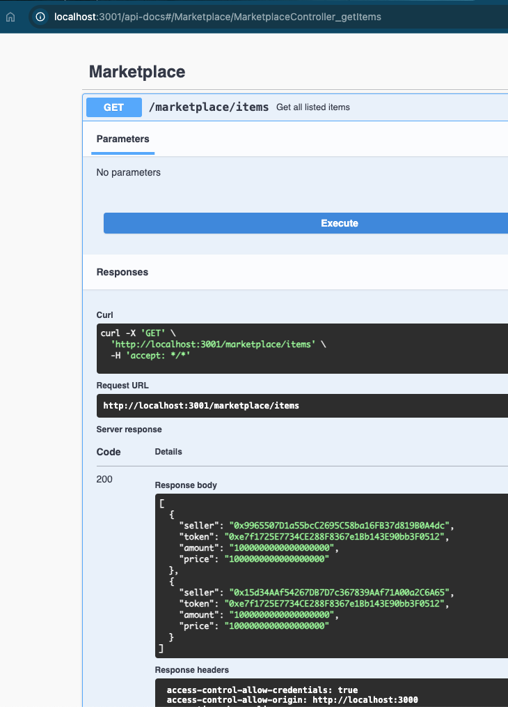

# Marketplace Backend Service

This is a backend service for a decentralized marketplace built using **NestJS**, **Ethers.js**, and **TypeScript**. The service interacts with a smart contract deployed on the blockchain, providing APIs for listing items, querying items, purchasing items, and managing token transfers.

## Features

- **List Items:** Add new items to the marketplace.
- **Query Items:** Fetch all listed items.
- **Purchase Items:** Buy items from the marketplace.
- **Withdraw Funds:** Withdraw accumulated earnings.
- **Token Transfers:** Handle token transfers using signed messages (EIP-712).

## Screenshots





## Project setup

```bash
$ npm install
```

- setup .env file

## Swagger Integration

```bash
$ npm run start
```

http://localhost:3001/api-docs


## Compile and run the project

```bash
# development
$ npm run start

# watch mode
$ npm run start:debug


